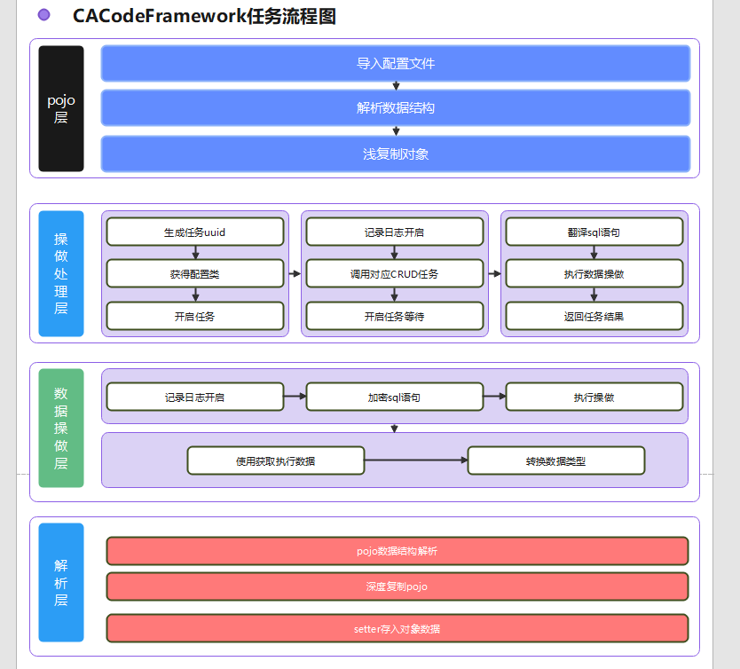

# 适用于 Python 语言所有web架构 的 ORM( Object-Relational-Mapping ) 框架

# 安装

    pip命令：pip install CACodeFramework

# 基础依赖

    simplejson==3.17.2

# 作者

    author:cacode  
    
    email:cacode@163.com
    
    皮皮虾：你在写臭虫?
    
    西瓜视频：你在写臭虫?
    
    bilibili：你在写臭虫?
    
    抖音：你在写臭虫?
    
    gitee：ca_code
    
    github:cctvadmin
    
    视频教程：先等我缓几天，一个人真的忙不过来

# 逻辑处理流程图

## 考虑到安全问题

考虑到安全问题，此ORM不提供以任何形式的 `truncate` 操做  
由于未熟读文档或操做失误导致的数据丢失均与本框架无关  
请使用前熟读文档

# 赞助商

蓝星灯塔科技有限公司

CACode开发团队

文档编辑于：2021/03/17 07:41  
作者：CACode
