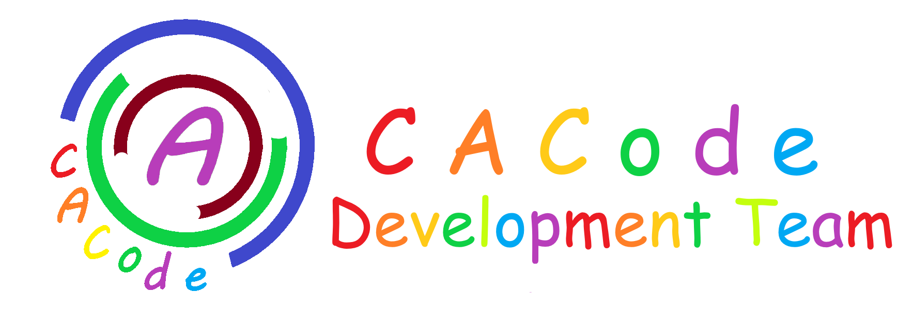

<p align="center">

</p>
<h1 align="center">Aestate —— 创建仅属于你的sql语法</h1>
<p align="center">
  
  
  <a href="http://doc.cacode.ren">
    
  </a>
  <a href="https://gitee.com/cacode_cctvadmin/summer-python/blob/main/LICENSE">
    
  </a>
</p>

# 介绍

<p style="white-space:pre-wrap;">
        Aestate Framework 是一款允许你自定义sql操作语法的orm (Object Relational Mapping)框架, 可以尽情发挥你的想象力，创造出属于你自己的sql操作方式。通过内置`DBUtils`来达到数据库操作和缓存，内置`simplejson`用于序列化和反序列化。
        修改后的`simplejson`非常强大,通过`aestate.cacode.Serialize.JsonUtil`获得json工具类, 可达到将`object`类型的数据解析成json字符串或者反序列化为字典格式。
        将最大限制的保留原始操作方式，允许工程师自定义一些特殊语法模板。支持分库分表多线程多进程执行，支持所有遵守DB-API2的数据库创建者
</p>

# 安装

> pip 命令：pip install aestate  
> anaconda 安装:conda install aestate

# 先决条件

> python >=3.6  
> 基础的 sql 知识  
> 教程文档地址：http://doc.cacode.ren

# 更全面的教程和文档

- [文字教程 doc.cacode.ren](http://doc.cacode.ren)
- [视频教程 bilibili.com](https://www.bilibili.com/video/BV1gq4y1E7Fs/)

# 开始学习

## 获得 demo 数据库

首先使用 mysql8.0 以上版本执行以下 sql 语句，创建我们的 demo 表

```sql
CREATE TABLE `demo`
(
    `id`          int                                                     NOT NULL AUTO_INCREMENT,
    `name`        varchar(255) CHARACTER SET utf8 COLLATE utf8_general_ci NOT NULL,
    `password`    varchar(255) CHARACTER SET utf8 COLLATE utf8_general_ci NOT NULL,
    `create_time` datetime                                                NOT NULL DEFAULT CURRENT_TIMESTAMP,
    `update_time` datetime                                                NOT NULL DEFAULT CURRENT_TIMESTAMP ON UPDATE CURRENT_TIMESTAMP,
    PRIMARY KEY (`id`) USING BTREE
)
```

在我们的项目目录创建一个名为`db_base.py`文件，用于保存我们的全局配置和模板  
然后我们来

## 创建一个数据库配置

```python
# 位置在:example.db_base.py

import pymysql

from summer.work.Config import Conf


class db_conf(Conf):
    def __init__(self):
        # 设置全局打印sql语句
        self.set_field('print_sql', True)
        # 设置全局插入语句返回最后一行id
        self.set_field('last_id', True)

        super(db_conf, self).__init__(
            # 数据库地址
            host='localhost',
            # 数据库端口
            port=3306,
            # 数据库名
            database='summer-demo',
            # 数据库用户
            user='root',
            # 数据库密码
            password='123456',
            # 数据库创建者，如果你用的是mysql，那么这里就是pymysql，如果用的是sqlserver，那么这里就应该是pymssql
            creator=pymysql)

```

### 配置解释:

```json
{
  "host": "数据库的路由 必填",
  "port": "数据库端口 必填",
  "database": "数据库名 必填",
  "user": "登录使用的用户 必填",
  "password": "用户的密码 必填",
  "charset": "编码格式 默认utf8",
  "creator": "数据库的创建者，如果你使用的是mysql，那么这里就需要import pymysql，然后将pymysql放入这个参数中 必填",
  "print_sql": "是否在执行之前打印sql语句 默认False",
  "last_id": "是否需要在insert插入操作结束后返回最后一行的行号，默认只返回受影响行数 默认False",
  "adapter": "适配器，用于自定义语法和解决sql语句不同方言的问题，你可以自定义处理流程和自定义关键字，例如默认使用`__like`模糊查询，你可以将`__like`改为`__f**k`只要你愿意 默认None"
}
```

## 创建 Template 模板表

```python
# 位置在:example.db_base.py

from summer.work import Manage


class table_template(Manage.Pojo):
    def __init__(self, **kwargs):
        """
        模板类对象
        """
        # 创建一个自增的主键id，并且不允许为空
        self.id = Manage.tag.intField(primary_key=True, is_null=False, comment='主键自增')
        # 创建一个创建时间，并设置`auto_time=True`，在第一次保存时可以为其设置默认为当前时间
        self.create_time = Manage.tag.datetimeField(auto_time=True, is_null=False, comment='创建时间')
        # 创建一个更新时间，并设置`update_auto_time=True`，保证每次修改都会更新为当前时间
        self.update_time = Manage.tag.datetimeField(update_auto_time=True, is_null=False, comment='更新实际按')
        # 如果子类包含`is_delete`字段，并且不为False时，为其添加一个是否删除的字段
        if 'is_delete' in kwargs.keys() and kwargs.get('is_delete'):
            # 设置是否删除，推荐使用int(boolean)
            self.is_delete = Manage.tag.tinyintField(default=int(False), is_null=False, comment='是否删除，0 未删除 1 删除')
        # 设置config_obj未db_conf的对象，
        super(table_template, self).__init__(
            # 导入配置类
            config_obj=db_conf(),
            # 设置日志配置
            log_conf={
                # 保存位置
                'path': "/log/",
                # 是否允许保存日志
                'save_flag': True,
                # 当日志到达多少MB时删除日志重新记录
                'max_clean': 100
            },
            # 必备的字段，每一个Pojo对象都必须包含一个`**kwargs`
            **kwargs)
```

### 配置解释:

```json
{
  "config_obj": "配置类对象 必填",
  "log_conf": "日志配置",
  "close_log": "是否关闭日志 默认False",
  "serializer": "序列化时使用的对象 默认QuerySet",
  "more...": "更多字段请查看源代码:summer.work.repository.Repository类"
}
```

## 为我们的 demo 表创建一个 Pojo

在根目录下新建一个包，名为:`tables`，并在`tables`包下创建一个名为`demoModels.py`文件，在文件内编写以下代码:

```python
# 位置在:example.tables.demoModels.py

from example.db_base import table_template
from summer.anno.annos import Table
from summer.work import Manage


# 使用装示器设置表的名称,name和msg是必填字段,name为表的名称,msg为表的注释
# 如果你不喜欢使用装示器，你也可以在__init__()中使用self.__table_name__来设置表的名称
# 如果你还是不喜欢，那就将这个类的名称写成表的名称，严格区分大小写
# 为了规范起见，也为了你后面接手的人不骂你，请务必填写描述文本
@Table(name='demo', msg='示例表')
# 使用表的全名为类名设置表的名称
# class demo(table_template):
class Demo(table_template):
    def __init__(self, **kwargs):
        # 新建一个名为name的字段，长度为20，不允许为空
        self.name = Manage.tag.varcharField(length=20, is_null=False, comment='名称')
        # 创建一个password字段
        self.password = Manage.tag.varcharField(length=20, is_null=False, comment='密码')
        # 使用内部变量设置表的名称
        # self.__table_name__ = 'demo'
        # 这里不设置`is_delete`字段
        super(Demo, self).__init__(**kwargs)
```

在这个`demoModels.py`下你可以尝试写更多的表，企业开发请务必按照功能来分开写model，因为如果你写的全挤在一起，就会看起来就跟一个月没洗的袜子一样

## 创建一个工厂类

回到我们的`db_base.py`这个文件内，新建一个类并命名为：`MyFactory`

```python
# 位置在:example.db_base.py

from summer.cacode.Factory import Factory


class MyFactory(Factory):
    # 这个是固定不变的，务必要死记下来
    modules = {
        # 设置映射关系为 `别名`:`包的位置`
        'demo': 'example.tables.demoModels'
    }

```

## 基础实战

在你的逻辑文件下使用，例如我这边的在`example.operas.basis`下  
无论你在哪个文件下开始，都需要先使用刚才写的工厂来创建一个Pojo对象

```python
from example.db_base import MyFactory

Demo = MyFactory.createInstance('demo.Demo')
```

### 查找操作 (find)

用法:

```python
result = Demo.find_all()
result = Demo.find_many(sql='SELECT * FROM demo')
result = Demo.find_one(sql='SELECT * FROM demo LIMIT 0,1')
result = Demo.find_field('id', 'name', 'password')
result = Demo.find_sql(sql='SELECT * FROM demo')
```

# CACode Development Team


