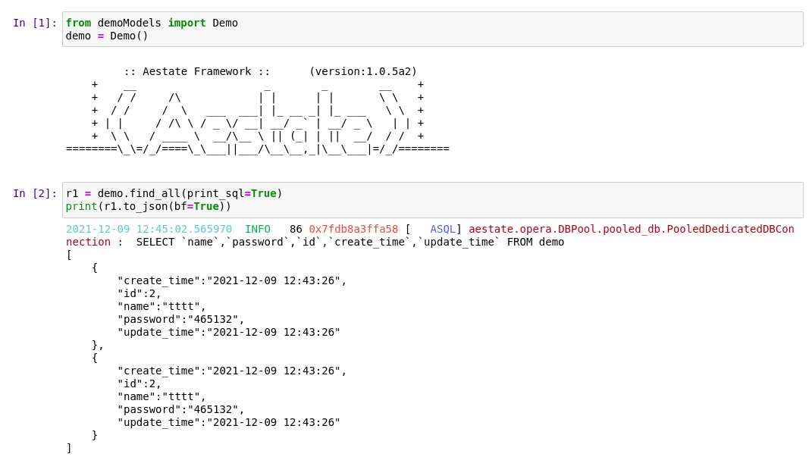

# 基础查询
本文使用1.入门中的Demo表作为示例

jupyter的代码在jupyternb目录下

查询可以用6种方式查询，包括基础sql查询、基本查询、orm查询、链式查询、装饰器查询、xml查询

# 基础sql查询

就像标题一样是要写sql语句的查询方式，用来给没有接触过orm和xml查询的新手作为入门使用

首先实例化你的表

```python
demo = Demo()
```
得到的对象就可以用来查询了，基础的sql查询又提供了5种方法方便执行，分别为：

- find_all()
- find_many()
- find_sql()
- find_field()
- find_one()

## find_all()
就是查询表种的所有数据，然后返回一个Serializer对象，里面包含了每行数据的结果，例如：
```python
from demoModels import Demo
demo = Demo()
r1 = demo.find_all(print_sql=True)
print(r1.to_json(bf=True))
```
运行结果为：




